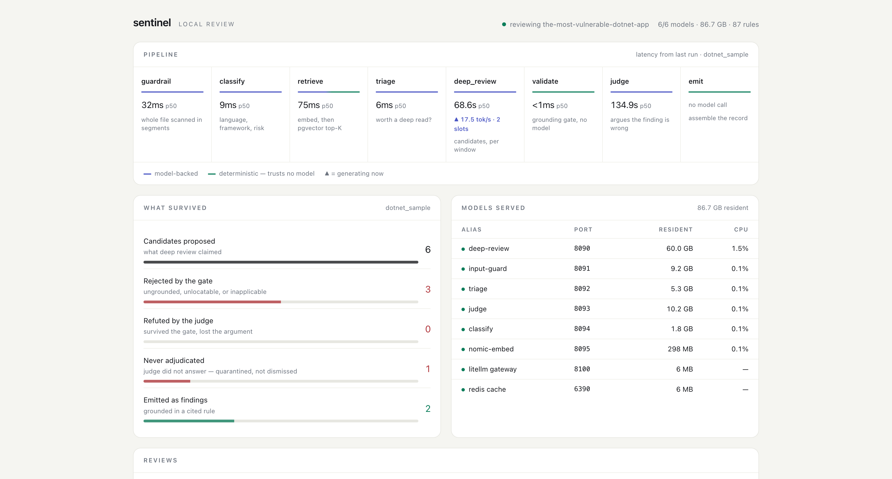

# Sentinel

Sentinel is a security code reviewer for source code that is not allowed to leave the building.

No cloud calls. No frontier models. Six open-weight models served locally by llama.cpp, a curated corpus of security rules in Postgres, and a pipeline that refuses to report a finding it cannot trace back to a specific rule and a verbatim line of your source.

## Start here

**Five minutes.** The three unusual decisions are [deterministic code as the trust boundary](#deterministic-code-is-the-trust-boundary), [a judge that argues the finding is wrong](#the-judge-argues-against-the-finding), and [an unanswered judge that refuses to look like a verdict](#an-unanswered-judge-is-not-a-verdict). Then [what the measurements say](#what-the-measurements-say), which is mostly what does not work yet, and a real report in [`examples/`](examples/) so you can see the output without downloading 74.5 GB of weights.

**Longer.** [`docs/architecture.md`](docs/architecture.md) for the layer map, the pipeline, and the finding lifecycle. [`docs/decisions.md`](docs/decisions.md) for what each design choice cost. [`evals/`](evals/) for how it gets measured and the ways the scorer has flattered it. [`docs/production.md`](docs/production.md) for the honest gap between this and something a team could depend on.

## Why this exists

Legal, healthcare, financial services, defense, and anyone working under a data residency rule all have the same problem: the code cannot go to a third party, so every hosted AI security tool is disqualified before the evaluation starts. The usual answer is to wait for a vendor to solve it. I wanted to know what one engineer could build instead.

The models are staged once, then the machine can be disconnected and the reviewer keeps working. Every client that transmits source code checks its endpoint at startup and refuses to run against anything that is not loopback, so this is enforced rather than merely configured. Overriding it takes `SENTINEL_ALLOW_REMOTE_MODELS=1`, which is named for what it costs and prints a warning saying the guarantee no longer applies. The six models are US-origin open weights totalling 74.5 GB, checked at startup against an allowlist that refuses to boot on a model outside it. That check reads the origin declared in `config/models.yaml`; it is a policy gate on my own configuration, not independent verification of who trained what.

## What actually works

### Deterministic code is the trust boundary

Every finding has to cite a rule that was actually retrieved for that region of the file and quote source text that actually appears there. That check lives in `graph/validation.py` and it is plain Python, not a model. Making deterministic code the trust boundary instead of asking a model to police itself is the decision I would make again.

It earns its keep. The reviewing model quotes source that is not in the file about 19% of the time, ten of fifty-three candidates in one measured run. Validation caught all ten. On inspection four of those ten were semantically correct findings whose snippets had collapsed a function body to `{ ... }`, so that number is a non-verbatim-snippet rate rather than a pure fabrication rate, and it was costing real findings until the validator learned to recover them.

### The applicability gate

The judge used to score whether a finding resembled the rule text, never whether the rule's preconditions held, so almost everything came back grounded. Deep review now has to name its evidence, the untrusted source and the sink and their line numbers, and code verifies those locations exist in the window the candidate came from. Be precise about what that buys: it proves the evidence is real and located, and it runs mechanical predicates for a handful of weakness families. It does not prove the rule applies. Access-control findings still rest on a reason the model wrote, because a missing check has no untrusted source to point at. A finding that cannot say where untrusted data enters is not a finding — except for the two classes where that question is meaningless: access-control defects, and single-location property or configuration defects such as a hardcoded secret or a weak cipher, which name a sink and no source by design. All of it is a weaker guarantee than deciding the rule holds.

Access control needed its own shape. A missing-authentication defect has no untrusted source, because nothing flows anywhere and the defect is the absence of a check. Demanding source-and-sink universally made the gate structurally incapable of passing that entire class.

### The judge argues against the finding

It tries to refute, and the finding survives only when refutation fails. Granite Guardian still scores groundedness, kept as telemetry rather than as the decision, because textual entailment turned out to be too weak for that job. In one run Guardian scored a candidate grounded at 0.99999 that the refutation pass correctly killed.

### An unanswered judge is not a verdict

The judge fails closed, so a timeout suppresses a finding exactly the way a refutation does. When both wrote the same reason string, an outage was indistinguishable from a judgement and findings could disappear behind text that read like a decision. Judge failures now land in `unadjudicated_candidates` with `summary.complete` false, a loud warning in the report, and exit code 4. A file that never finished review does the same thing with exit code 3.

### Triage gates the expensive model

A 2B model decides whether the 49B reviewer runs on a file at all. Guardrail, classify, retrieve, and triage together take about eight seconds per file. Deep review takes over a minute.

### One choke point for LLM calls

Timeouts are deadlines rather than per-request budgets, and retries, structured output, and metrics all live in `models/gateway.py`. Retrieval keeps a second client in `retrieval/embedder.py`, so 'every call' would be an overstatement; both route their endpoint through `netguard.require_loopback`. When LiteLLM returned corrupted response indices on partially cached batch embeddings, a shape check in that file caught it. Without that check the system would have paired the wrong rule vectors with the wrong code and reported findings grounded in rules it never retrieved.

## What the measurements say

Development happened against private code I cannot publish, so those numbers are not in this repository. What I can say without the data behind it is worth reading anyway, because the failure modes were consistent.

**The same wrong answers show up in every language.** A health check endpoint reported as missing authentication, citing a rule whose own text says to exclude health checks. TLS verification reported as disabled in a file where the library verifies by default and the disabling call appears nowhere. SQL injection reported on a parameterized query, grounded on a Django rule in a file that imports no Django. Every one of those had a direct counterpart across Python and JavaScript runs. Language changed, framework changed, rule set changed, and the failure modes did not.

**Findings are not reproducible.** Same file, same retrieved rules, temperature zero, and two runs produce different findings. Measured stability on one target was 0.289 across two runs. Temperature zero removes sampling randomness and does not make multi-slot llama.cpp inference deterministic. I have not isolated the exact mechanism, so I am reporting the measurement rather than a cause.

**The first public benchmark: DVNA.** `evals/ground_truth/dvna.yaml` is transcribed from Damn Vulnerable NodeJS Application's own documented vulnerability inventory, written before Sentinel was ever run against it, which is the property that makes recall a measurement rather than a bound on what I already knew.

On DVNA at commit 9ba473a — 16 documented in-scope defects across 12 JavaScript files — Sentinel reported **2 findings, both true positives, zero false positives**: OS command injection in the ping handler and a hardcoded `express-session` secret. It detected **2 of the 6 defects its 51-rule corpus has a rule for, and 0 of the 10 it does not.** Run in 434.77s on a cold cache, complete, no unadjudicated candidates.

Read those numbers carefully, because I would rather you trusted the next one. Precision is a **lower bound**, not a measurement: the ground truth is marked `exhaustive: false`, so an unmatched finding is unadjudicated rather than proven wrong, and with two findings the sample is thin either way. Ten of the sixteen defects having no matching rule is the honest headline, and it points at corpus size rather than at the reviewer. This is one run, so there is **no stability figure** here and nothing below should be read as one.

What made the number trustworthy was mostly unglamorous: the inventory was transcribed before the first run, audited line-by-line against source twice, and three separate defects in the scoring harness were found and fixed *before* any number was published — one of which scored a correct, verbatim, correctly-grounded detection as both a false positive and a miss.

Treat this as an architecture you can read and argue with, now with one benchmark behind it.

## How a review works

One file at a time, through a LangGraph pipeline:

```
guardrail -> classify -> retrieve -> triage -> deep_review -> validate -> judge -> emit
```

Retrieval chunks the file with tree-sitter, groups chunks into review windows under a token budget, embeds them, and pulls the top rules per window out of Postgres with pgvector. Deep review proposes findings per window. Validation rejects anything that cannot be tied to a retrieved rule and real source. The applicability gate rejects anything whose evidence does not hold up. The judge tries to refute what survives.

`uv run sentinel dashboard` serves that pipeline on `127.0.0.1:8200`, and a review started from a terminal opens it automatically. A piped or redirected run does not, because a browser opening in CI is a surprise rather than a courtesy.



Two things it is built to show. The line under each stage says what that stage trusts: indigo is model-backed, green is deterministic code that takes no model's word for anything. And **What survived** is the funnel, which is the honest picture of this design — most of what the reviewing model proposes gets thrown away, and you can see which gate threw it away. The run above kept two of six.

Live token rates come from each llama-server's own log rather than from the reviewer, so the dashboard is a reader and never something the review path depends on. It is read-only, loopback-enforced through the same check the model clients use, and serves no route that can start, stop, or reconfigure anything.

Architecture detail is in `docs/architecture.md`, and `docs/decisions.md` records what each design choice cost. Evaluation method is in `evals/`. `docs/production.md` is the honest gap between this and something a team could depend on.

## Quick start

```sh
make bootstrap          # uv env, Postgres with pgvector, database schema
make backends-up        # six llama-server backends on :8090-:8095
make proxy-up           # Redis and the LiteLLM gateway on :8100
uv run sentinel rules load
uv run sentinel status

umask 077               # reports contain verbatim source snippets
uv run sentinel review path/to/repo -o ./sentinel-report

make eval               # score a report against adjudicated ground truth
```

Models are expected as GGUF files under `~/.lmstudio/models/`. Port and model mapping is in `config/models.yaml`. The local LiteLLM proxy uses a master key from that config; no external provider credentials exist anywhere in the system.

Exit codes: 0 clean, 3 a file errored during review, 4 the review finished but some candidates were never adjudicated. Anything other than 0 means the findings list is an undercount.

`litellm[proxy]` pulls in `litellm-enterprise`, which is proprietary licensed. It is required to run the local proxy. Nothing in it phones home during a review, and every call still resolves to loopback, but you should know it is being installed.

## Known limitations

Read these before you point it at anything you care about.

- Precision is low. Expect to triage most findings yourself.
- Results vary between runs. Do not gate continuous integration on it.
- Recall is worse than precision. The single-file architecture cannot see a vulnerability that spans files, and authorization bugs in particular tend to live across a request handler in one file and a data access layer in another.
- The rule corpus is 87 rules. For JavaScript that is small enough that retrieval returns nearly every eligible rule regardless of the file, so retrieval contributes little signal.
- Framework detection covers Flask, Django, FastAPI, Express, Fastify, Angular, Next.js, React, and ASP.NET Core. Anything else reviews against language-level rules only.
- **C# and Razor support is beta and I would not rely on it yet.** An adversarial review of that work turned up fifteen defects; the ones that regressed Python, JavaScript and TypeScript are fixed and pinned by tests, but eight remain and nearly all of them are ways a real C# finding gets silently discarded. They are written up in [`docs/known-issues.md`](docs/known-issues.md). A clean C# report is not evidence that there is nothing there.
- Reports contain verbatim source, and so do suppressed candidates, unadjudicated candidates, and error strings. Run with `umask 077` and keep the output directory outside the repository.
- The walker ignores `.gitignore`. It excludes `node_modules`, `dist`, build caches, and similar by name, and refuses symlinks that resolve outside the review root.

## Contributing

The rule corpus is the easiest place to start and the place where a contribution helps most. See `CONTRIBUTING.md`.

## Stack

Python 3.12 managed with uv, LangGraph, Pydantic v2, Postgres with pgvector, LiteLLM, llama.cpp, tree-sitter.

Models: Llama Guard 3 for input guarding, Llama 3.2 1B for classification, Granite 3.3 2B for triage, Nemotron Super 49B for review, Granite Guardian 3.3 for judging, and nomic-embed-text-v1.5 for embeddings. No weights are distributed with this repository. Model licenses differ and are listed in `docs/models.md`.

License: Apache 2.0
