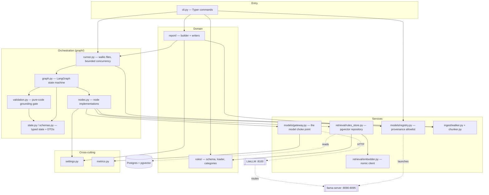
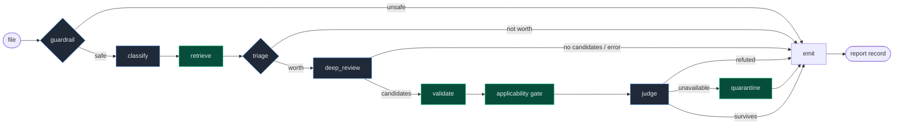
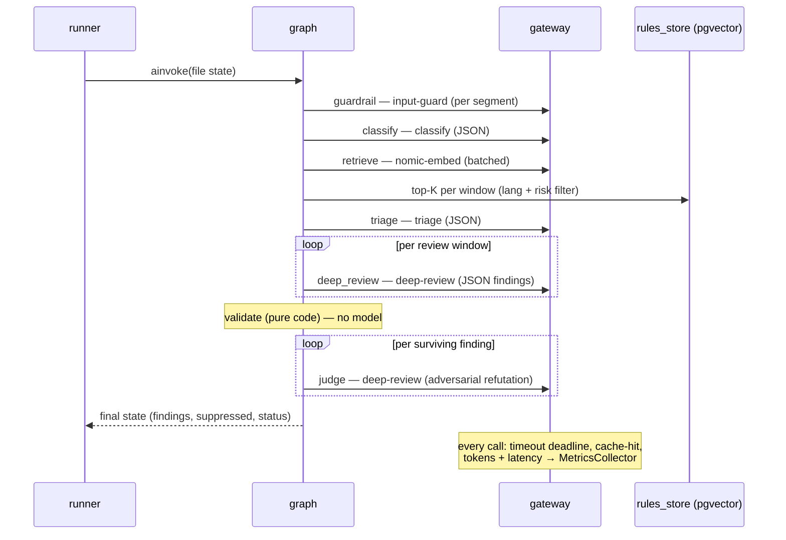
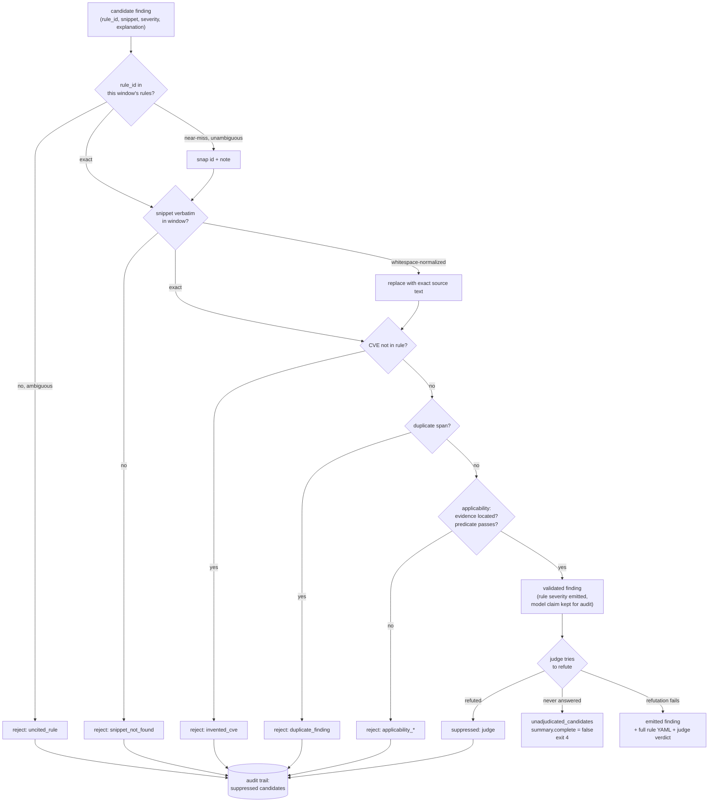

# Sentinel Architecture

This document describes the **as-built** architecture: the layers, the
dependency rules, the design patterns, and the runtime flow of a review. It
describes what the code actually is rather than what it was meant to be.

## 1. Layered view

Sentinel is organized into layers with a strict **downward-only** dependency
rule: a layer may depend on the ones below it, never above or sideways into a
peer's internals. `settings.py` and `metrics.py` are cross-cutting leaves that
anything may import.

**Why these layers.** The split that matters most is **orchestration vs.
services**: the graph decides *what* happens and in what order; the services
(`gateway`, `rules_store`, `ingest`) know *how* to talk to a model, a database,
or a filesystem, and nothing about the review flow. That keeps every node
unit-testable by injecting a fake `Gateway`, and lets the deterministic
`validation.py` sit as a pure function with no I/O.

## 2. The review pipeline

A single file is reviewed by a LangGraph state machine (`graph/graph.py`). The
runner invokes it once per file under an `asyncio.Semaphore(FILE_CONCURRENCY)`.
Three conditional edges short-circuit straight to `emit`.

Green = pure/deterministic (no model trust). Blue = model-backed. Note that
**retrieve** is deterministic given the embeddings, and **validate** is the
pure-code grounding gate — the two nodes that make findings defensible.

| Node | Model (alias) | Role | Key detail |
|------|---------------|------|------------|
| guardrail | `input-guard` (Llama Guard 3) | block malicious input | scans the **whole file in bounded segments** + filename regex; an unsafe verdict halts unless EVERY category it names is in `GUARDRAIL_ADVISORY_CATEGORIES` (currently `{S14}`), in which case it is recorded as a warning and the file is reviewed |
| classify | `classify` (Llama 3.2 1B) | language / framework / risk categories | JSON-grammar output; framework detected deterministically from imports |
| retrieve | `nomic-embed` + pgvector | rules per review window | chunk → window (≤8k tok) → batch-embed → top-K=20 **per window** |
| triage | `triage` (Granite 3.3 2B) | skip cheap files | sees a sample from **every** window, not just a prefix |
| deep_review | `deep-review` (Nemotron 49B) | emit candidate findings | reasoning-off + JSON grammar; runs **per window**; each candidate tagged with its window |
| validate | (pure code) | the grounding guarantee | see §4 |
| applicability | (pure code) | is the claimed evidence real and located? | model must name untrusted source + sink with lines; code verifies they exist in the window, then runs mechanical predicates for 5 CWE families. 13 sink-only families waive source evidence. Access-control CWEs need a located sink plus a non-empty model-written reason, whose truth is NOT checked |
| judge | `deep-review` (Nemotron 49B) | adversarial refutation | argues the finding is WRONG; survives only if refutation fails. Sees the gate-verified `untrusted_source`/`sink` lines, not just the quoted line, so it cannot refute for missing context the gate already proved. Granite Guardian scores groundedness as telemetry, not as the decision |
| emit | — | assemble the file record | sets terminal status, clears live objects |

### 2a. Language support and the grammar/language split

`ingest/walker.py` maps a file extension to two separate values, and the
distinction matters:

| Extension | `language` (rule corpus) | `grammar` (tree-sitter) |
|-----------|--------------------------|-------------------------|
| `.py` | python | python |
| `.js` `.jsx` `.mjs` `.cjs` | javascript | javascript |
| `.ts` `.tsx` | typescript | tsx |
| `.cs` | csharp | csharp |
| `.razor` `.cshtml` | csharp | **razor** |

**Why they are separate.** Razor source participates in the C# rule corpus — a
`.razor` component and a `.cs` controller are reviewed against the same C#
rules — but its mixed markup/code syntax needs the Razor grammar to find chunk
boundaries. Collapsing the two would either parse Razor with the C# grammar
(losing every boundary in the file) or split the corpus by extension (so a
`.razor` file could not retrieve a C# rule). `grammar` threads from
`SourceFile` through `retrieve_rules` → `chunk_file` and
`deep_review_window` → `validate_applicability`, which uses it to decide
whether a claimed sink is executable code or displayed markup.

C# chunking is not the generic top-level walk. `_csharp_declaration_ranges`
descends through `namespace`/`class`/`struct`/`record`/`interface` containers
until it reaches their direct members, because the useful review unit in ASP.NET
Core is the **controller action**, not the controller class. Treating the outer
class as one declaration would hide every method boundary in the file.

**Frameworks.** `aspnetcore` is detected deterministically from
`Microsoft.AspNetCore` imports, MVC attributes (`[HttpGet]`, `[Route]`,
`[Authorize]`), minimal-hosting calls (`WebApplication.CreateBuilder`,
`MapControllers`), Blazor types (`ComponentBase`, `IJSRuntime`), and Razor
directives (`@page`, `@inject`, `@rendermode`). Aliases map `asp.net`,
`aspnet`, `blazor`, `razor`, and `razor pages` onto the single corpus value
`aspnetcore` so the `+0.05` framework rerank actually fires.

## 3. One file, end to end

## 4. The finding lifecycle (the grounding guarantee)

The product's core promise — *no ungrounded findings* — is enforced by a
**deterministic layer that never trusts the model** for anything checkable.
`graph/validation.py` is pure functions; the LLM's output is raw material, not
truth.

Three gates in series: deterministic validation, then the applicability gate, then an adversarial judge. Everything any gate drops lands in the **audit trail** in the report, never silently.

A judge that never answered is not a gate decision and is kept apart from one. Those candidates go to `unadjudicated_candidates`, set `summary.complete` to false, and exit 4. A timeout that reports itself as a judgement is the worst failure this system can have, because the report still looks complete. Line numbers are always recomputed from where the snippet is
actually found; severity is always the rule's declared value with the model's
claim retained only for audit.

## 5. Design patterns in use

| Pattern | Where | What it buys |
|---------|-------|--------------|
| **Gateway / facade** | `models/gateway.py` | the choke point for LLM calls (retrieval embeds through its own client): overall-deadline timeouts, JSON-schema structured output with a repair retry, cache-hit detection, token/latency metrics. Swap the whole model tier by pointing it elsewhere. |
| **Repository** | `retrieval/rules_store.py` | all pgvector access (upsert, atomic reload under advisory lock, top-K query) behind one object; the graph never writes SQL. |
| **Pipeline / state machine** | `graph/graph.py` + `state.py` | explicit nodes and conditional edges over a typed `TypedDict` state; short-circuit paths are edges, not buried `if`s. |
| **Registry + policy** | `models/registry.py` + `config/models.yaml` | single source of truth for backends; **Section 1532 provenance allowlist** enforced at load — a non-US-origin model is a hard startup error. |
| **Pure validation layer** | `graph/validation.py` | the grounding guarantee as deterministic, side-effect-free code, independently testable without any model. |
| **Dependency injection** | `build_graph(gateway)`, nodes take `gateway` first | fakes in tests; no global model client. |
| **External prompt templates** | `models/prompts/*.md` via `string.Template` | prompts are data, versioned and diffable, not string-concatenated in code. |
| **Builder / writer split** | `report/builder.py` vs `report/{json,markdown}_writer.py` | assembly of the report structure is separate from serialization; one model, many renderings. |
| **Strategy fallback** | deep review Plan A (grammar) → Plan B (`extract_json` + repair) | a reasoning model that ignores the grammar still yields valid output. |

## 6. Dependency rules (enforced by convention)

- **Downward only.** `cli → orchestration → services → domain`. No service
  imports an orchestration module; no domain module imports a service.
- **`settings.py` and `metrics.py` are leaves.** They import nothing internal
  and may be imported anywhere. Tunables (thresholds, K, timeouts,
  concurrency) live in `settings.py` so no layer borrows a constant from
  another module.
- **Nodes never instantiate an HTTP client**; they call `gateway.*`. The gateway
  is the choke point for everything routed through it, but calling it the ONLY
  model client overstates the case: `retrieval/embedder.py` builds its own
  `httpx.Client` and posts directly to `/v1/embeddings`. Both route their base URL
  through `netguard.require_loopback`, so the air-gap invariant does hold — it is
  just enforced in two places, not one.
- **The registry is the only thing that knows GGUF paths and ports.** The
  gateway calls models by *alias* and is ignorant of where they run.

## 7. Known seams and deliberate debt

Honest notes, not hidden:

- **`report.builder → graph.runner`** for the `RunResult` dataclass is the one
  remaining cross-layer edge. It's defensible (report consumes the runner's
  output DTO), but if a third consumer of `RunResult` appears, move it to a
  shared `types` module.
- **`nodes.py` is a single multi-node module.** Cohesive at the current size;
  if a node grows its own helpers substantially, split per-node.
- **State carries live objects between nodes** (`_window_objects`,
  `_candidate_windows`) under underscore keys. A pragmatic LangGraph idiom —
  they're cleared at `emit` — but they are not serializable, so there is no
  graph checkpointer this pass (runs are single-process and short-lived).
- **`judge_groundedness` lives in the generic gateway.** It is Granite-Guardian
  specific; if a second judge model is added, lift the template handling into a
  `models/judge.py`.
- **Cache is exact-match, not semantic** (deviation D2) — a deliberate safety
  choice: a semantic cache could return a stale review for a file differing
  only in its vulnerable line.
- **C# SQL-injection detection (CWE-89) is unstable run to run — treat it as
  best-effort, not a guarantee.** The reasoning is right and the failure is
  transcription: deep review rewrites the C# interpolated string
  `$"SELECT ... WHERE Name = '{name}'"` into a concatenation of quoted parts and
  variables. The rewritten text does not exist in the file, so the verbatim
  snippet check and the evidence locator correctly discard an otherwise correct
  finding. Prompt rule 2 now forbids the rewrite explicitly; that made it pass
  on one run and regress on the next, which is llama.cpp's documented
  nondeterminism (continuous batching reorders floating-point reductions, so
  greedy decoding at temperature zero still flips close calls) rather than a
  defect with a fixed location.

  Consequences to be honest about: **a clean report is not evidence that a C#
  codebase has no SQL injection**, and any single-run recall figure for CWE-89
  is a sample rather than a measurement. The case is kept in the `.NET` fixture
  spec marked `unstable: true`, so a miss warns instead of failing the
  end-to-end gate — a case that flips between runs would otherwise make the gate
  noisy, and a noisy gate stops being read. It is not excused: it stays in the
  spec at its exact location and every miss is printed. Interpolation is not
  C#-specific — and as of 2026-08-01 this is no longer a suspicion. There is a
  confirmed **Python** instance: `flask_sqli` `app.py:38`,
  `query = "SELECT ... LIKE '%" + name + "%'"`, a line mixing adjacent
  alternating quote characters. It was missed in four consecutive runs and
  mangled two DIFFERENT ways across two fresh runs — one swapped `'` for `"`, the
  other did that and appended a trailing `)` absent from the file. It is marked
  `unstable: true` with the mechanism written out. Seen together, the two cases
  are one defect from opposite directions: in C# the model rewrites an
  interpolated string into a concatenation; in Python it cannot reproduce quotes
  it only has to copy. A prompt mitigation was tried (rule 2 now prefers a shorter
  exactly-reproducible fragment) and measurably fixed neither.
- **The guardrail can now be scoped by category — RESOLVED 2026-08-01.**
  This section previously said `nodes.guardrail_check` halts on *any* unsafe
  verdict unconditionally, and that scoping it was left open. That is no longer
  what the code does. The problem was real: the `.NET` smoke fixture's Blazor page
  was rejected as **S14 (Code Interpreter Abuse)** solely for containing
  `JS.InvokeVoidAsync("eval", ...)` — the very construct
  `cwe-79-blazor-unsafe-js-interop` exists to find — and a blocked file is never
  reviewed, so that rule could never fire on its target.
  Sean's call was to make S14 advisory. `GUARDRAIL_ADVISORY_CATEGORIES = {"S14"}`
  in `settings.py` downgrades it to a recorded warning and the file IS reviewed;
  everything else still halts. Reports separate ⛔ `rejected_inputs` (not
  reviewed) from ⚠️ guardrail warnings (reviewed, objection noted).
  **The downgrade is per-verdict, not per-category-seen:** Llama Guard can name
  several categories at once, and an early version took only the first match, so
  `unsafe\nS14,S1` downgraded on S14 and silently discarded S1. A verdict halts
  unless EVERY category it names is advisory.

## 7a. The dashboard

`sentinel dashboard` serves a single read-only page on `127.0.0.1:8200`: the
eight-stage pipeline with per-stage latency and live token rates, the funnel of
what each gate dropped, models served, recent runs, and backend logs. A review
started from a terminal starts it automatically; a piped or redirected run does
not, because spawning a browser in CI is a surprise rather than a courtesy.

Three constraints shaped it, and each is enforced rather than documented:

- **It is a reader, never a dependency.** Live token rates are scraped from each
  llama-server's own `slot print_timing` log lines, not pushed by the runner. A
  dashboard the reviewer had to feed would be a dependency from the review path
  onto its own telemetry, and a failure there could fail a review. `ensure_running`
  returns `None` rather than raising for the same reason.
- **Loopback, through the same check the model clients use.** `serve` and
  `ensure_running` both call `netguard.require_loopback`. The page serves backend
  logs from a machine reviewing code that cannot leave the building, so binding it
  to `0.0.0.0` would defeat the property the rest of the system enforces.
- **Read-only, with no path it can be talked into.** No route starts, stops, or
  reconfigures anything. `tail_log` resolves its alias against the model registry
  rather than sanitizing a string, so a traversal attempt has nothing to address.

Stdlib `http.server` and no web framework: a security tool that advertises a
small auditable surface should not grow one to draw six status rows. The page is
`dashboard.html` beside the module — it is markup, so it is edited as markup, and
a lint rule written for Python has no business reflowing it. It loads no external
font, script, or stylesheet, because that would quietly falsify the guarantee the
page prints in its own footer.

`dashboard.py` is a leaf: nothing in the review path imports it.

## 8. Where to change things

| To change… | Edit |
|------------|------|
| a threshold, timeout, or K | `src/sentinel/settings.py` |
| which models run / a port / provenance | `config/models.yaml` (+ `scripts/start-backends.sh` reads it) |
| how a node prompts its model | `src/sentinel/models/prompts/<node>.md` |
| the grounding rules | `src/sentinel/graph/validation.py` |
| retrieval ranking | `src/sentinel/retrieval/rules_store.py` (`query_similar`) |
| the pipeline shape (nodes/edges) | `src/sentinel/graph/graph.py` |
| report layout | `report/builder.py` (structure) or `report/*_writer.py` (rendering) |
| add a security rule | new YAML under `rules/`; `sentinel rules validate` then `rules test <id>` |
| the dashboard page | `src/sentinel/dashboard.html` (markup) or `dashboard.py` (data collection) |
| which guardrail categories warn instead of block | `settings.GUARDRAIL_ADVISORY_CATEGORIES` |
| add a language | `ingest/walker.py` (`EXTENSION_LANGUAGES` + `EXTENSION_GRAMMARS`), `ingest/chunker.py` (`_TS_LANGUAGE` + `_TOP_LEVEL_NODES`), `rules/schema.py` (`SUPPORTED_LANGUAGES`), `graph/evidence.py` (`_PARSER_NAMES`) |
| add a framework | `graph/nodes.py` (`_FRAMEWORK_PATTERNS` + `_FRAMEWORK_ALIASES`), then rules under `rules/framework-specific/<name>/` |
| classify a new CWE's evidence shape | `graph/evidence.py` (`_SINK_ONLY_CWES`, `_ACCESS_CONTROL_CWES`, `_CWE_PREDICATES`) — unknown CWEs default to flow-required, so the corpus fails closed |
