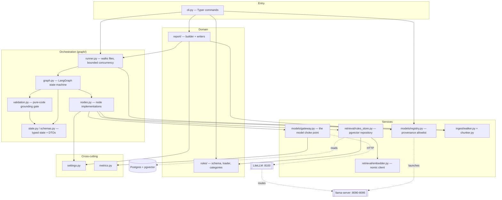
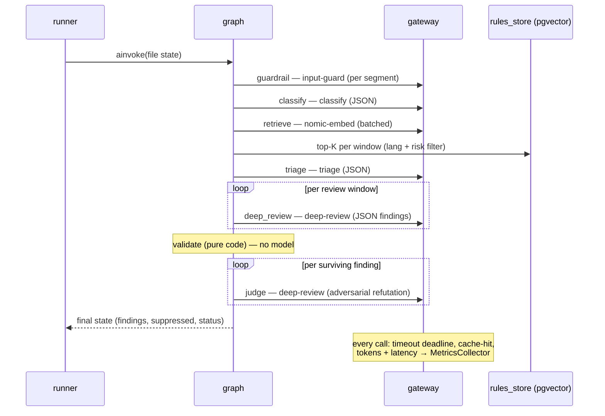
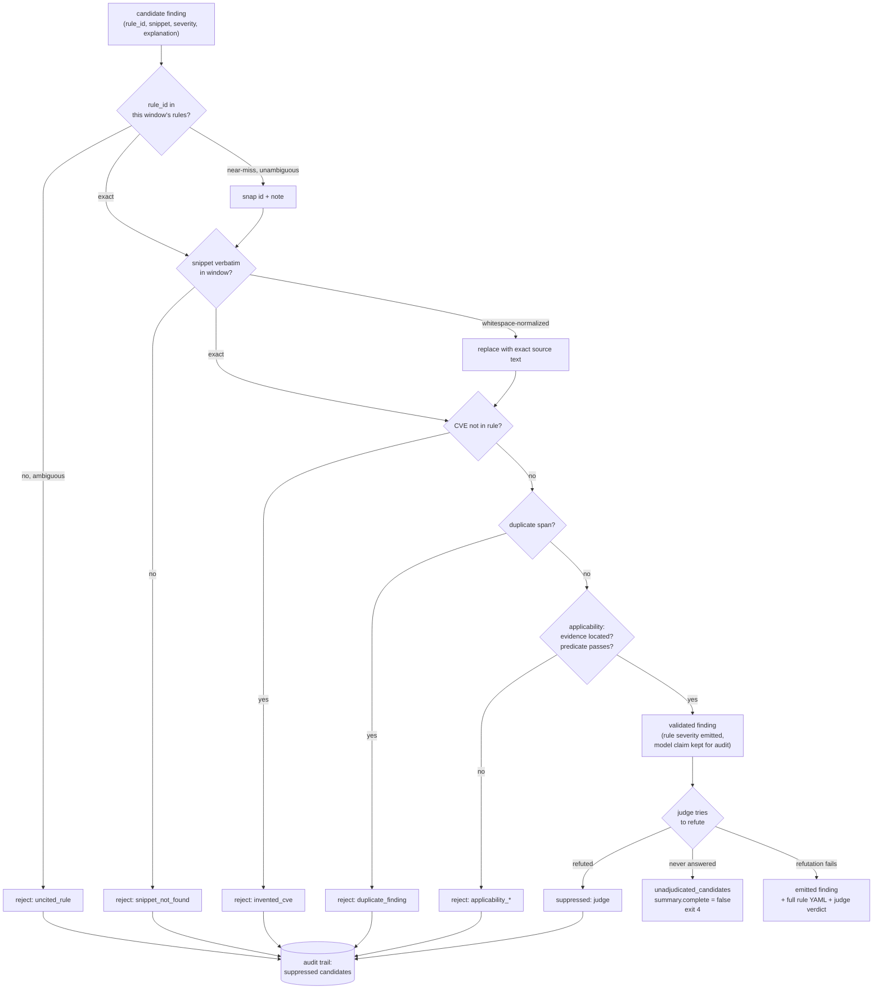

# Sentinel Architecture

This document describes the **as-built** architecture: the layers, the
dependency rules, the design patterns, and the runtime flow of a review. It
describes what the code actually is rather than what it was meant to be.

## 1. Layered view

Sentinel is organized into layers with a strict **downward-only** dependency
rule: a layer may depend on the ones below it, never above or sideways into a
peer's internals. `settings.py` and `metrics.py` are cross-cutting leaves that
anything may import.

**Why these layers.** The split that matters most is **orchestration vs.
services**: the graph decides *what* happens and in what order; the services
(`gateway`, `rules_store`, `ingest`) know *how* to talk to a model, a database,
or a filesystem, and nothing about the review flow. That keeps every node
unit-testable by injecting a fake `Gateway`, and lets the deterministic
`validation.py` sit as a pure function with no I/O.

## 2. The review pipeline

A single file is reviewed by a LangGraph state machine (`graph/graph.py`). The
runner invokes it once per file under an `asyncio.Semaphore(FILE_CONCURRENCY)`.
Three conditional edges short-circuit straight to `emit`.

Green = pure/deterministic (no model trust). Blue = model-backed. Note that
**retrieve** is deterministic given the embeddings, and **validate** is the
pure-code grounding gate — the two nodes that make findings defensible.

| Node | Model (alias) | Role | Key detail |
|------|---------------|------|------------|
| guardrail | `input-guard` (Llama Guard 3) | block malicious input | scans the **whole file in bounded segments** + filename regex; any unsafe verdict halts |
| classify | `classify` (Llama 3.2 1B) | language / framework / risk categories | JSON-grammar output; framework detected deterministically from imports |
| retrieve | `nomic-embed` + pgvector | rules per review window | chunk → window (≤8k tok) → batch-embed → top-K=20 **per window** |
| triage | `triage` (Granite 3.3 2B) | skip cheap files | sees a sample from **every** window, not just a prefix |
| deep_review | `deep-review` (Nemotron 49B) | emit candidate findings | reasoning-off + JSON grammar; runs **per window**; each candidate tagged with its window |
| validate | (pure code) | the grounding guarantee | see §4 |
| applicability | (pure code) | is the claimed evidence real and located? | model must name untrusted source + sink with lines; code verifies they exist in the window, then runs mechanical predicates for 5 CWE families. 12 sink-only families waive source evidence. Access-control CWEs need a located sink plus a non-empty model-written reason, whose truth is NOT checked |
| judge | `deep-review` (Nemotron 49B) | adversarial refutation | argues the finding is WRONG; survives only if refutation fails. Granite Guardian scores groundedness as telemetry, not as the decision |
| emit | — | assemble the file record | sets terminal status, clears live objects |

## 3. One file, end to end

## 4. The finding lifecycle (the grounding guarantee)

The product's core promise — *no ungrounded findings* — is enforced by a
**deterministic layer that never trusts the model** for anything checkable.
`graph/validation.py` is pure functions; the LLM's output is raw material, not
truth.

Three gates in series: deterministic validation, then the applicability gate, then an adversarial judge. Everything any gate drops lands in the **audit trail** in the report, never silently.

A judge that never answered is not a gate decision and is kept apart from one. Those candidates go to `unadjudicated_candidates`, set `summary.complete` to false, and exit 4. A timeout that reports itself as a judgement is the worst failure this system can have, because the report still looks complete. Line numbers are always recomputed from where the snippet is
actually found; severity is always the rule's declared value with the model's
claim retained only for audit.

## 5. Design patterns in use

| Pattern | Where | What it buys |
|---------|-------|--------------|
| **Gateway / facade** | `models/gateway.py` | the choke point for LLM calls (retrieval embeds through its own client): overall-deadline timeouts, JSON-schema structured output with a repair retry, cache-hit detection, token/latency metrics. Swap the whole model tier by pointing it elsewhere. |
| **Repository** | `retrieval/rules_store.py` | all pgvector access (upsert, atomic reload under advisory lock, top-K query) behind one object; the graph never writes SQL. |
| **Pipeline / state machine** | `graph/graph.py` + `state.py` | explicit nodes and conditional edges over a typed `TypedDict` state; short-circuit paths are edges, not buried `if`s. |
| **Registry + policy** | `models/registry.py` + `config/models.yaml` | single source of truth for backends; **Section 1532 provenance allowlist** enforced at load — a non-US-origin model is a hard startup error. |
| **Pure validation layer** | `graph/validation.py` | the grounding guarantee as deterministic, side-effect-free code, independently testable without any model. |
| **Dependency injection** | `build_graph(gateway)`, nodes take `gateway` first | fakes in tests; no global model client. |
| **External prompt templates** | `models/prompts/*.md` via `string.Template` | prompts are data, versioned and diffable, not string-concatenated in code. |
| **Builder / writer split** | `report/builder.py` vs `report/{json,markdown}_writer.py` | assembly of the report structure is separate from serialization; one model, many renderings. |
| **Strategy fallback** | deep review Plan A (grammar) → Plan B (`extract_json` + repair) | a reasoning model that ignores the grammar still yields valid output. |

## 6. Dependency rules (enforced by convention)

- **Downward only.** `cli → orchestration → services → domain`. No service
  imports an orchestration module; no domain module imports a service.
- **`settings.py` and `metrics.py` are leaves.** They import nothing internal
  and may be imported anywhere. Tunables (thresholds, K, timeouts,
  concurrency) live in `settings.py` so no layer borrows a constant from
  another module.
- **The gateway is the only thing that talks to models.** Nodes never
  instantiate an HTTP client; they call `gateway.*`. This is what makes the
  "everything through LiteLLM, no cloud calls" invariant checkable in one file.
- **The registry is the only thing that knows GGUF paths and ports.** The
  gateway calls models by *alias* and is ignorant of where they run.

## 7. Known seams and deliberate debt

Honest notes, not hidden:

- **`report.builder → graph.runner`** for the `RunResult` dataclass is the one
  remaining cross-layer edge. It's defensible (report consumes the runner's
  output DTO), but if a third consumer of `RunResult` appears, move it to a
  shared `types` module.
- **`nodes.py` is a single multi-node module.** Cohesive at the current size;
  if a node grows its own helpers substantially, split per-node.
- **State carries live objects between nodes** (`_window_objects`,
  `_candidate_windows`) under underscore keys. A pragmatic LangGraph idiom —
  they're cleared at `emit` — but they are not serializable, so there is no
  graph checkpointer this pass (runs are single-process and short-lived).
- **`judge_groundedness` lives in the generic gateway.** It is Granite-Guardian
  specific; if a second judge model is added, lift the template handling into a
  `models/judge.py`.
- **Cache is exact-match, not semantic** (deviation D2) — a deliberate safety
  choice: a semantic cache could return a stale review for a file differing
  only in its vulnerable line.

## 8. Where to change things

| To change… | Edit |
|------------|------|
| a threshold, timeout, or K | `src/sentinel/settings.py` |
| which models run / a port / provenance | `config/models.yaml` (+ `scripts/start-backends.sh` reads it) |
| how a node prompts its model | `src/sentinel/models/prompts/<node>.md` |
| the grounding rules | `src/sentinel/graph/validation.py` |
| retrieval ranking | `src/sentinel/retrieval/rules_store.py` (`query_similar`) |
| the pipeline shape (nodes/edges) | `src/sentinel/graph/graph.py` |
| report layout | `report/builder.py` (structure) or `report/*_writer.py` (rendering) |
| add a security rule | new YAML under `rules/`; `sentinel rules validate` then `rules test <id>` |
